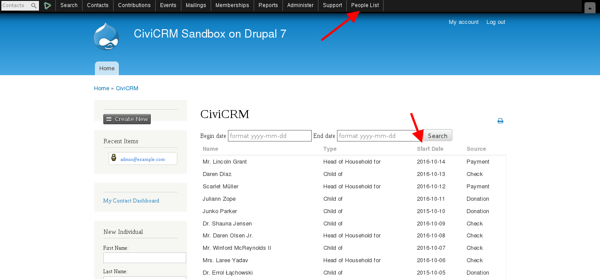
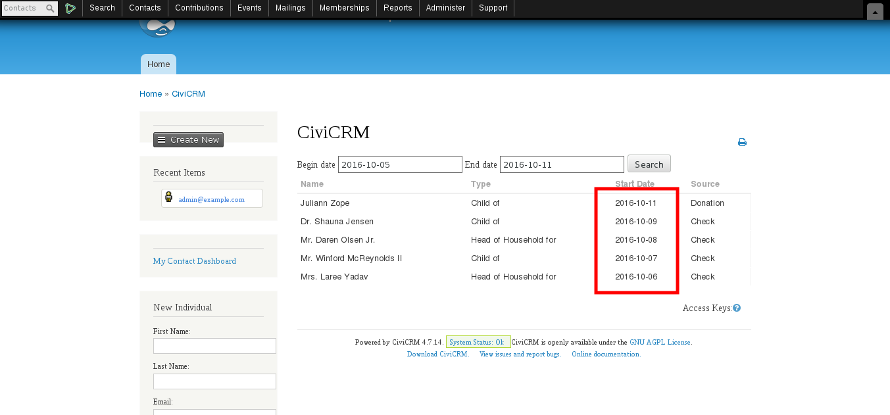
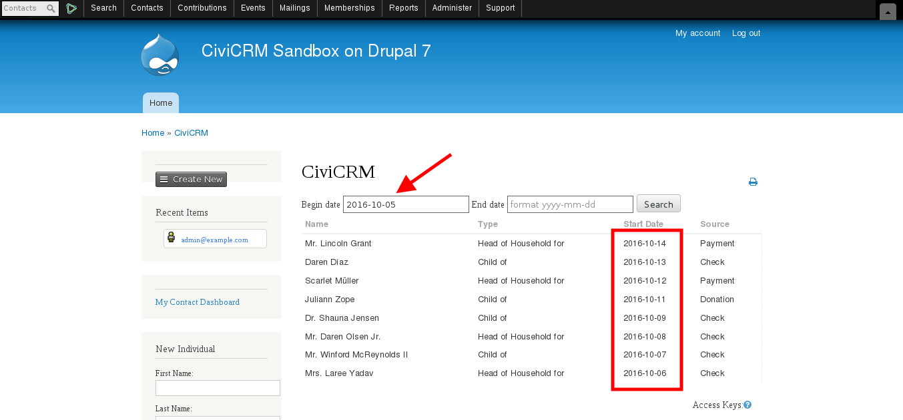

# com.test.peoplelist
CiviCRM People List (Memberships, with start date filter)

## Implementation notes:

### PHP:

    Created a API function to search Memberships and merge with the Contact name
    api/v3/People/Search.php

### AngularJS:
    Created a single call to People/Search, with optional start date range argument
    ang/peoplelist/PeopleListCtrl.js

### CiviCRM:
    Registered the menu link for the People List

## Tests

### Running without filters

### Running with begin and end date filters

### Running only with the begin date filter

